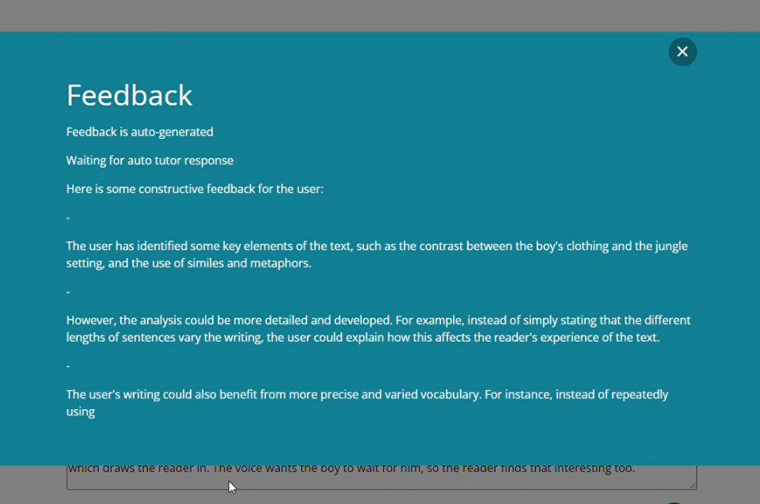

# adapt-textInput-AI

**Text Input AI** is a *question component*

**Text Input AI** is a question component that allows the learner to input text. Their answer is marked and graded by AI based upon a model answer you give. This plugin is designed for long text form input in a single text area.

## Installation

Can be installed directly into the adapt-framework or via the authoring tool. 

*Important:* This plugin requires the tutor extension to work. It will not mark the question without it.

You will need a ChatGPT API key. 

*Note:* This plugin is currently hard coded to use chatGPT 3.5 turbo.

## Settings Overview

The attributes listed below are used in *components.json* to configure **Text Input AI**, and are properly formatted as JSON in [*example.json*](https://github.com/theodi/adapt-textInput-AI/blob/master/example.json).

### Attributes

In addition to the attributes specifically listed below, [*question components*](https://github.com/adaptlearning/adapt_framework/wiki/Core-Plug-ins-in-the-Adapt-Learning-Framework#question-components) can implement the following sets of attributes:
+ [**core model attributes**](https://github.com/adaptlearning/adapt_framework/wiki/Core-model-attributes): These are inherited by every Adapt component. They have no default values. Like the attributes below, their values are assigned in *components.json*.
+ [**core buttons**](https://github.com/adaptlearning/adapt_framework/wiki/Core-Buttons): Default values are found in *course.json*, but may be overridden by **Text Input's** model in *components.json*.

**\_component** (string): This value must be: `textinputAI`.

**\_classes** (string): CSS class name to be applied to [core plug-in]’s containing `div`. The class must be predefined in one of the Less files. Separate multiple classes with a space.

**\_layout** (string): This defines the horizontal position of the component in the block. Acceptable values are `full`, `left` or `right`.

**instruction** (string): This optional text appears above the component. It is frequently used to
guide the learner’s interaction with the component.

**ariaQuestion** (string): This will be read out by screen readers instead of reading the title, body & instruction fields when focusing on the group or radiogroup.

**systemAI** (string): Typically, the system message is used to set the behavior or role of the AI assistant in the conversation. It can provide introductory text, instructions, or any other information you want the model to be aware of before it processes the user's input. For example "You are helping mark student work and giving feedback on answers given model answers. The student has been asked to ..."

**modelAnswer** (string): This is the model answer against which the AI assistant will grade the users answer and give feedback. 

**maxScore** (integer): The maximum score the AI assistant can give.

**passScore** (integer): The minimim score required to mark the answer as correct.

**chatTemplate** (string): This is where the user answer goes and gives any further help to the AI assistant. For example "The users answer to the question is: \n\n {{userAnswer}} \n\n Give the user some constrcutive feedback on their answer and reward as necessary."

**aiAPIKey** (string): Your API key for use with the AI assistant.

**\_attempts** (integer): This specifies the number of times a learner is allowed to submit an answer. The default is `1`.

**\_shouldDisplayAttempts** (boolean): Determines whether or not the text set in **remainingAttemptText** and **remainingAttemptsText** will be displayed. These two attributes are part of the [core buttons](https://github.com/adaptlearning/adapt_framework/wiki/Core-Buttons) attribute group. The default is `false`.

**\_questionWeight** (number): A number which reflects the significance of the question in relation to the other questions in the course. This number is used in calculations of the final score reported to the LMS.

**\_canShowModelAnswer** (boolean): Setting this to `false` prevents the [**_showCorrectAnswer** button](https://github.com/adaptlearning/adapt_framework/wiki/Core-Buttons) from being displayed. The default is `true`.

**\_canShowFeedback** (boolean): Setting this to `false` disables feedback, so it is not shown to the user. The default is `true`.

**\_canShowMarking** (boolean): Setting this to `false` prevents ticks and crosses being displayed on question completion. The default is `true`.

**\_recordInteraction** (boolean) Determines whether or not the learner's answer(s) will be recorded on the LMS via cmi.interactions. Default is `true`. For further information, see the entry for `_shouldRecordInteractions` in the README for [adapt-contrib-spoor](https://github.com/adaptlearning/adapt-contrib-spoor).

**\_feedback** (object): Feedback is generated by the AI assistant. However if you are using the SCORM (spoor) plugin then it is not possible to store the feedback to be restored! This plugin uses cookies to store the userAnswer and Feedback, but this only works if the user resumes their session on the same device. To handle siutations where the session is restored on another device, you can show feedback based upon the rawScore. 

>**title** (string): Title text for the feedback that will be displayed when the question is submitted.

>**\_incorrect** (object): Texts that will be displayed when the submitted answer is incorrect. It contains values that are displayed under differing conditions: **final** and **notFinal**.

**\_bands** (object array): Multiple items may be created. Each item represents the feedback and opportunity to retry for the appropriate range of scores. **\_bands** contains values for **\_score**, **feedback**, **\_allowRetry** and **\_classes**.

>**\_score** (number):  This numeric value represents the raw score that indicates the low end or start of the range. 

>**feedback** (string): If no stored feedback is accessible, this text will be displayed to the learner when the learner's score falls within this band's range. 

### Accessibility
**Text Input** has been assigned a label using the [aria-label](https://github.com/adaptlearning/adapt_framework/wiki/Aria-Labels) attribute: **ariaRegion**. This label is not a visible element. It is utilized by assistive technology such as screen readers. Should the region's text need to be customised, it can be found within the **globals** object in [*properties.schema*](https://github.com/adaptlearning/adapt-contrib-textInput/blob/master/properties.schema).

<a href="#top">Back to Top</a>

**Note to developers:**
**Text Input AI** varies significantly from other Adapt *question components*. Although there is a model answer, marking cannot be repeated, so the result has to be stored. Additionally, the feedback is unique to every press of the submit button, so this also has to be stored. If your brain is programmed to think like SCORM and how restore answers is traditionally done, then this component is not for you. It works with SCORM 1.2 and there are fall backs integrated into the component, but these are not ideal, but they are functional (including the use of cookies to store what cannot be retrieved from SCORM). Also note that cmi.interactions (student response) is a JSON object consisting of the answer and feedback, not just the answer.

## Limitations

Ensure you proposed use will fall within ChatGPTs rate limits. The component displays a timer which will increase in time if rate limits are exceeded. 

SCORM is not deisnged for this use case. Although cmi.interactions can store the raw answer, it cannot be restored unless full support for SCORM 2004 is present (currently this plugin does not support this however)

cmi.interactions will also be where you can find the feedback from the AI assistant. The student response will be a JSON object containing the user answer ("\_userAnswer") and the feedback from the AI assistant ("\_userFeedback").

In XAPI these are stored in the approprate variables of the same name.

## Disclaimer

Currently the plug-in does not have a mechanism for people to appeal the grading and comments the AI assistant gives. The publishers of the plugin are not respoinsible for how the AI assistant responds and it is highly recommended that a thorough evaluation be carried out on the use of this component prior to deployment. This should be done for every single reuse. Later versions of the plugin will include "report and rate this feedback" functionality. Alternatively you could include instructions in the "\_feedback" section. This plugin is not recommended for use in situations where it's grading is part of a qualification that is used to make decisions about a persons future, e.g. certified courses.

----------------------------
**Author / maintainer:** The Open Data Institute
**Accessibility support:** WAI AA
**RTL support:** Yes
**Cross-platform coverage:** Chrome, Chrome for Android, Firefox (ESR + latest version), Edge, IE11, Safari 12+13 for macOS/iOS/iPadOS, Opera